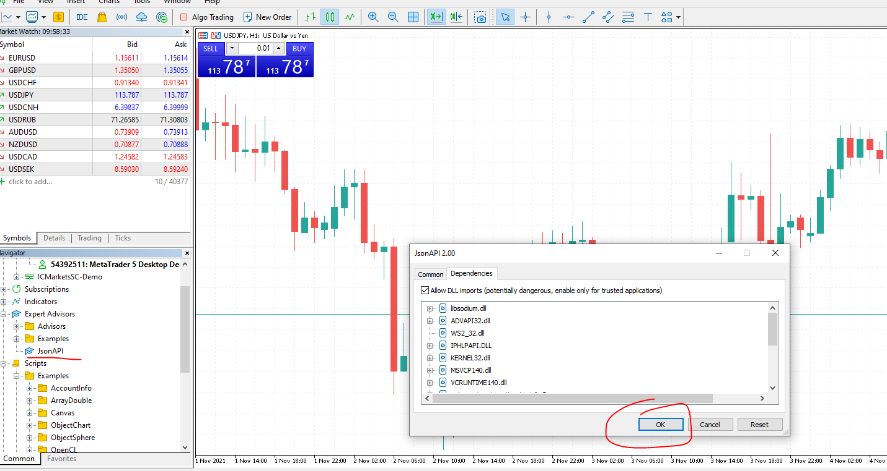

### Installation with ZMQ instruction

- Clone zmq  
  ``git clone git@github.com:shroukkhan/mql-zmq.git``
- Copy `mql-zmq/Library/MT5/libsodium.dll` and `mql-zmq/Library/MT5/libzmq.dll` to `MQL5/Libraries` folder    
  
- Copy `mql-zmq/Include/Mql` and `mql-zmq/Include/Zmq` to `MQL5/Include` folder  
  
- Create `MQL5/Scripts/ZMQ` folder and copy everything from `mql-zmq/Scripts/` folder to it  
  
- Enable dll import in MQL5  
  
- Compile `MQL5/Scripts/ZMQ/TestZmq.mq5`
  
- Run it in MT5 by double clicking it:
  
- Done with zmq!
- Now copy `MQL5-JSON-API/Include/*` to `MQL5/Include`
  
- Copy `MQL5-JSON-API/Indicators/JsonAPIIndicator.mq5` to `MQL5/Indicators` folder  
  
- Copy `MQL5-JSON-API/Experts/JsonAPI.mq5` to `MQL5/Expers` folder and compile it
  
- Drag it to the chart in MT5 and you should get this popup
    